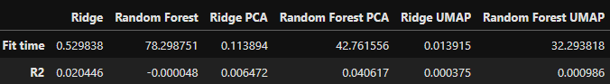
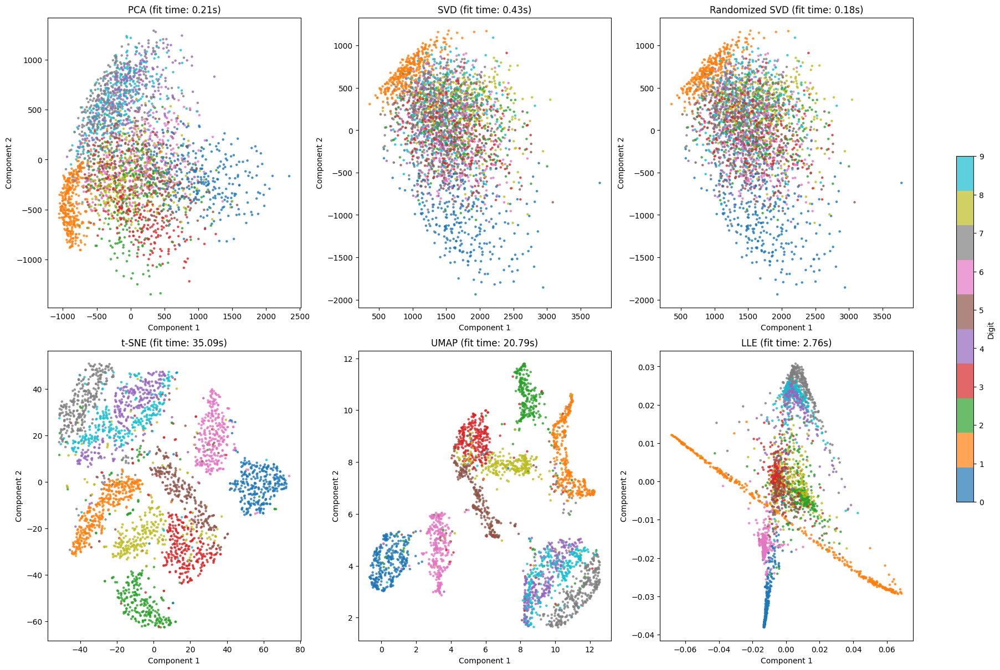
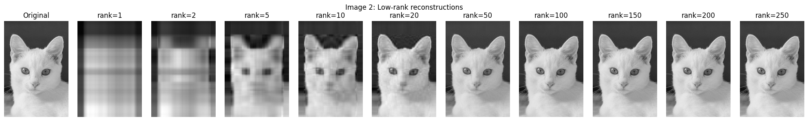
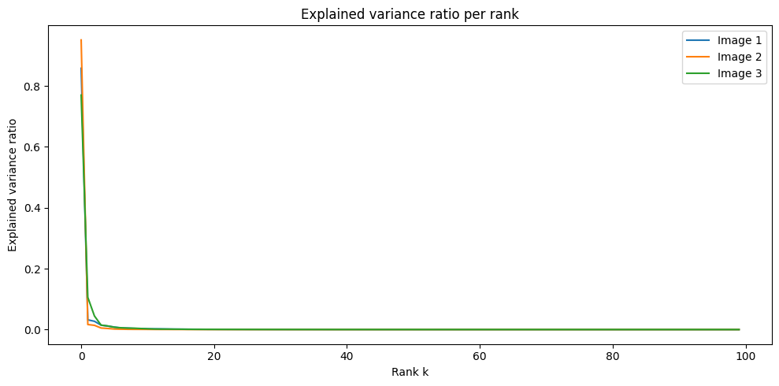
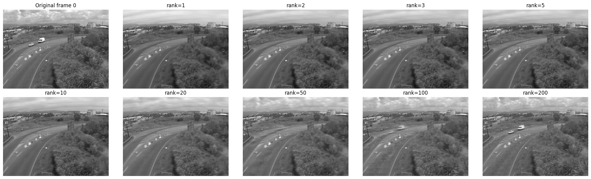
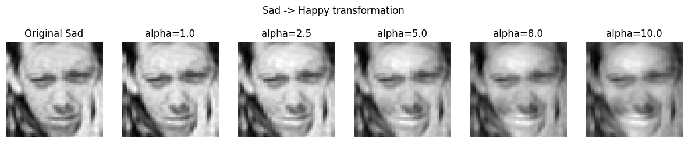
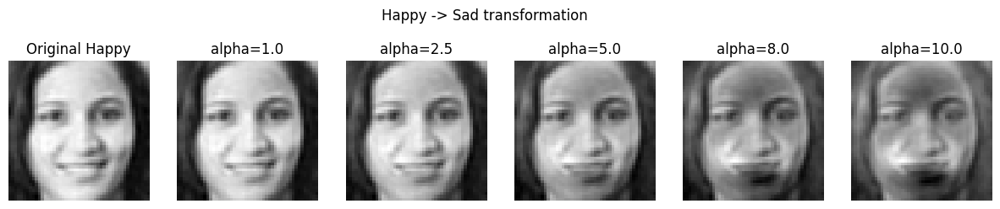

# Dimensionality Reduction Task

## Project Overview
This project investigates unsupervised learning approaches, primarily concentrating on techniques for reducing data dimensionality. The implementations address practical challenges such as collaborative filtering, visual data compression, video analysis, and semantic facial feature manipulation.

## Tools & Technologies
- **Python Libraries**: NumPy, Pandas, Matplotlib, Scikit-learn, TensorFlow, Optuna, UMAP
- **Dimensionality Reduction**: PCA, SVD, TruncatedSVD, t-SNE, UMAP, LLE
- **Models**: Ridge Regression, Random Forest
- **Image Processing**: PIL, OpenCV

---

## Predicting User Attributes from Interaction Data
Linear and ensemble models were developed to estimate user age based on their book rating history within a recommendation system context. The experiment compared performance on both raw sparse features and compressed representations.

**Key Findings:**
- Linear models significantly outperformed tree-based models in computational efficiency
- PCA and UMAP compression showed minimal improvement in predictive performance

---

## Visualizing High-Dimensional Handwritten Digits
Six different manifold learning and projection techniques were applied to transform MNIST digit images into two-dimensional space for visual inspection.

**Key Findings:**
- **t-SNE** and **UMAP** produced the most distinct and well-separated digit clusters
- **PCA**, **SVD**, and **Randomized SVD** showed similar results (linear methods)
- **LLE** performed well but was computationally intensive
- t-SNE had the longest fit time, while UMAP provided a good balance of speed and quality

---

## Image Compression via Matrix Decomposition
Singular value decomposition was employed to construct low-rank approximations of grayscale images, exploring the trade-off between compression ratio and visual fidelity.

**Key Findings:**
- **Explained variance** measures how much of the total information (variance) is preserved by the rank-k approximation
- The singular value spectrum shows a steep decay for natural images
- **Rank 50-100** provides good reconstruction quality with significant compression
- Higher ranks (>200) yield minimal visual improvement but require more storage

---

## Extracting Stationary Background from Video Sequences
SVD was applied to a video dataset to decompose frames into static background and dynamic foreground components through low-rank reconstruction.

**Key Findings:**
- **Low-rank (r=1-3)** approximation captures the static background
- Higher ranks introduce moving objects and noise
- Rank 1 or 2 is sufficient for background extraction
- This technique is the basis for **background subtraction** in video surveillance
---

## Manipulating Facial Expressions in Latent Space
PCA was utilized to establish a semantic direction within the latent representation space, enabling controlled expression transformation between sad and happy faces.

**Key Findings:**
- The vector difference between class centroids (`happy_mean - sad_mean`) encodes the primary expression variation axis
- Traversing this direction produces smooth expression transitions while maintaining individual identity characteristics
- Small scaling factors yield subtle expression adjustments; larger factors generate exaggerated emotional displays
- This demonstrates the capability for **semantic vector arithmetic** within learned latent spaces

---

## Overall Conclusion

Dimensionality reduction techniques are powerful tools for:
- **Data compression** while preserving essential information
- **Visualization** of high-dimensional data in 2D/3D space
- **Feature extraction** for downstream machine learning tasks
- **Latent space manipulation** for creative applications

The experiments collectively illustrate that dimensionality reduction serves as a fundamental building block in modern data analysis and machine learning workflows, with technique selection heavily dependent on the specific requirements of each application domain.
